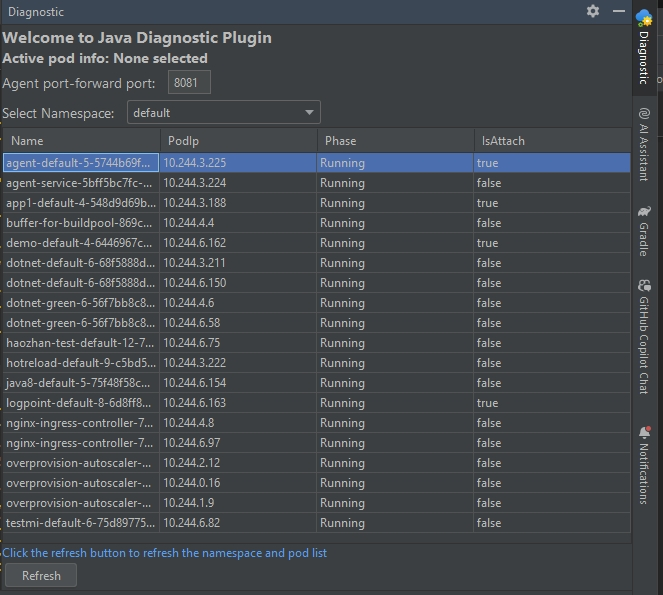
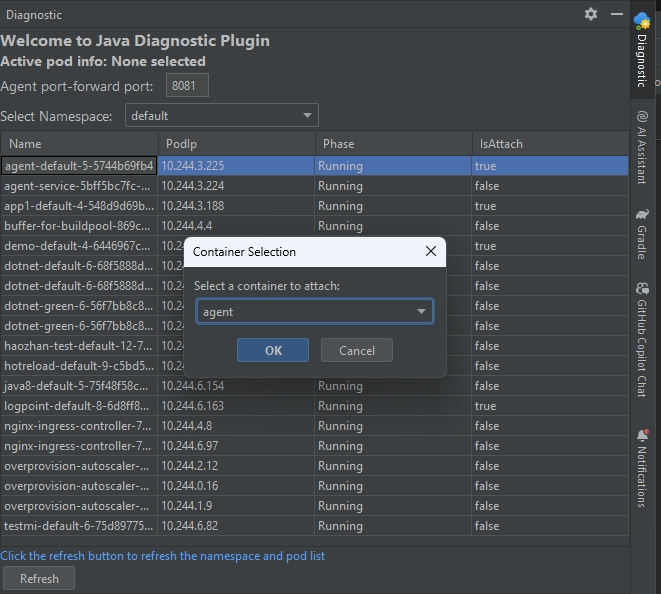
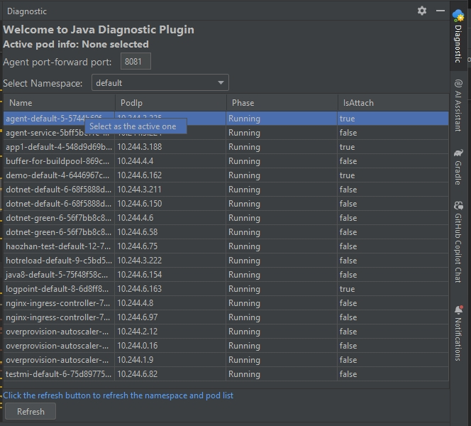
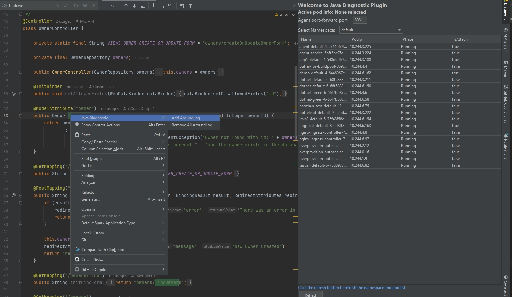
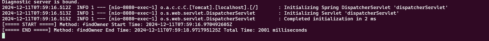

# Java Diagnostic Tool on AKS plugin
> This plugin is used to attach Java diagnostic agent to the Java application which running in a pod container on Azure Kubernetes Service (AKS) cluster.
> 
> After Attach, it allows to do some troubleshooting like add logs around a class function, to test if the function is executed and calculate the total cost of the function
>
> It's useful when locate the performance bottleneck of the Java application.

## How to use
### [Prerequisites](#prerequisites)
  - install the plugin
  - install [diag4j](https://github.com/microsoft/diag4j) in Your Cluster
  - Run `kubectl port-forward svc/diag4j-agent-service {port}:8080` in local, once the port determined, configure it in plugin, the default port is 8081
    (TODO: update it when agent service is add in diag4j)
### Agent Overview Dashboard
  - you can configure your port which forward to the agent service in local
  - the pods show in the table are listed with kubeconfig in local environment

    
### Attach Agent
  - click the pod you want to attach the agent and select the container, only one container in the pod can be attached
  - wait the attach process to complete
  
    
### Set active pod container
 Once attach the agent successfully, we can use the agent to help do some troubleshooting. Because there may be existed multiple pods inject the agent, so we should set an active one first. Later operations on the code in IDE will be based on the active pod container.

- 

### Add log around a class function
- select the class and function you want to add log, then click the "Add AroundLog" button. In below example, after add log, then call "
  {host}/owner/1", you can see the log print before and after the function called

### Remove all configured logs
- click the "Remove All AroundLogs" button, all the logs added by the agent will be removed